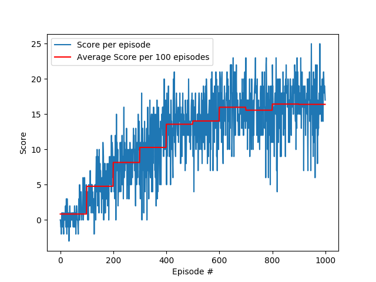

# Navigation Project

## Project Details
This project consist of training an agent to navigate and collect bananas in a large, square world.

A reward of +1 is provided for collecting a yellow banana, and a reward of -1 is provided for collecting a blue banana. Thus, the goal of the agent is to collect as many yellow bananas as possible while avoiding blue bananas.

The state space has 37 dimensions and contains the agent's velocity, along with ray-based perception of objects around the agent's forward direction. Given this information, the agent has to learn how to best select actions. Four discrete actions are available, corresponding to:

- `0` - move forward.
- `1` - move backward.
- `2` - turn left.
- `3` - turn right.

The task is episodic, and in order to solve the environment, the agent must get an average score of +13 over 100 consecutive episodes.

## Results

To solve this project, a Deep Q-Network was created with its model and agent architectures on files `model.py` and `dqn_agent.py`. The agent solved the problem in ~500 episodes, as seen in the graphic:

Below you can see how the trained agent is perfoming on the task (Score = 17):

## Instructions

First of all, you need to clone this repository: `git clone https://github.com/jardsantos/navigation_project`

### Getting Started

- In order to use this repository you must have [Anaconda(or just python 3)](https://www.anaconda.com/distribution/) and [Pytorch](https://pytorch.org/get-started/locally/) installed.

- To set up the environment follow the instructions `1`to `3` of [DRLND GitHub repository](https://github.com/udacity/deep-reinforcement-learning#dependencies).

- Download the Unit Environment, put it on the folder of this repository and unzip (or decompress) the file. To download, select one of the environment that matches your operation system:
    - Linux: [click here](https://s3-us-west-1.amazonaws.com/udacity-drlnd/P1/Banana/Banana_Linux.zip)
    - Mac OSX: [click here](https://s3-us-west-1.amazonaws.com/udacity-drlnd/P1/Banana/Banana.app.zip)
    - Windows (32-bit): [click here](https://s3-us-west-1.amazonaws.com/udacity-drlnd/P1/Banana/Banana_Windows_x86.zip)
    - Windows (64-bit): [click here](https://s3-us-west-1.amazonaws.com/udacity-drlnd/P1/Banana/Banana_Windows_x86_64.zip)

### Run agent

To run the trained agent you need to run `agent.py` including the path to your unit environment.

On terminal: `python agent.py PATH_TO_UNIT_ENVIRONMENT`

### How to train the agent

If you want to train your agent using different hyperparameters, follow these steps:

1. Open `train.py` file and change its hyperparameters:
    - `N_EPISODES`: maximum number of training episodes.
    - `MAX_T`: maximum number of timesteps per episode.
    - `EPS_START`: starting value of epsilon, for epsilon-greedy action selection.
    - `EPS_END`: minimum value of epsilon.
    - `EPS_DECAY` : multiplicative factor (per episode) for decreasing epsilon.

2. Open `dqn_agent.py` file and change its hyperparameters:
    - `BUFFER_SIZE`: replay buffer size.
    - `BATCH_SIZE`: minibatch size.
    - `GAMMA`: discount factor.
    - `TAU`: for soft update of target parameters.
    - `LR`: learning rate.
    - `UPDATE_EVERY`: how often to update the network.

3. On terminal run: `python train.py PATH_TO_UNIT_ENVIRONMENT`