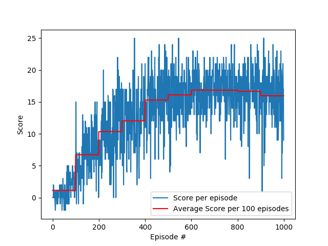
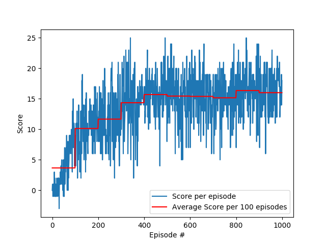
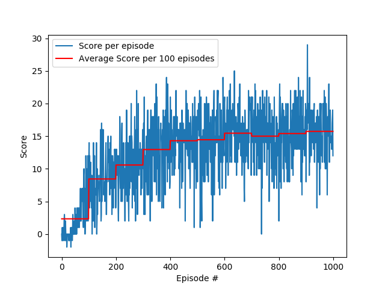

# Project Report

## Learning Algorithm

To solve the task it was tested four different Deep Reinforcement Learning models involving combinations of Vanilla Deep Q-Network, Dueling Network and Double Deep Q-Network:

1. Vanilla DQN
2. Double DQN
3. Duel DQN
4. Double Duel DQN

In all models the hyperparameters chosen were the same, as described below:

* Agent Parameters

    * Replay buffer size: 100.000
    * Minibatch size: 64
    * Discount factor: 0.99
    * Soft update of target parameters: 0.001
    * Learning rate: 0.0005
    * How often to update the network: every 4 steps

* Training Parameters

    * Number of training episodes: 1000
    * Maximum number of timesteps per episode: 1000
    * Starting value of epsilon, for epsilon-greedy action selection: 1.0
    * Minimum value of epsilon: 0.01
    * Multiplicative factor (per episode) for decreasing epsilon: 0.985

Since the problem state was given, the network architectures did not need any convolutional network and was composed with fully connected layers with relu activation on all layers but the output(last) one:

* DQN Architecture:

    ```
        Input Fully connected layer - input: 37(state size); output: 64; activation: relu

        Hidden Fully connected layer - input: 64; output: 64; activation: relu

        Output Fully connected layer - input: 64; output: 4(action size); no activation function
    ```

* Duel Network Architecture:

    * Advantage Function:

        ```
        Input Fully connected layer - input: 37(state size); output: 64; activation: relu

        Hidden Fully connected layer - input: 64; output: 64; activation: relu

        Output Fully connected layer - input: 64; output: 4(action size); no activation function
        ```

    * State size Function:

        ```
        Input Fully connected layer - input: 37(state size); output: 64; activation: relu

        Hidden Fully connected layer - input: 64; output: 64; activation: relu

        Output Fully connected layer - input: 64; output: 1; no activation function
        ```

    * Output return:

        ```
            Q(s,a) = V(s) + A(s,a) - mean(A(s,a))
        ```

## Results

### 1. Vanilla DQN:

* Plot

<p align=center></p>

* Log Report

```
Episode 100     Average Score: 1.144    Accumulative Time: 00:01:52
Episode 200	Average Score: 6.72	Accumulative Time: 00:03:46
Episode 300	Average Score: 10.34	Accumulative Time: 00:05:41
Episode 400	Average Score: 12.04	Accumulative Time: 00:07:39
Episode 500	Average Score: 15.29	Accumulative Time: 00:09:41 -   solved***
Episode 600	Average Score: 16.10	Accumulative Time: 00:11:41
Episode 700	Average Score: 16.85	Accumulative Time: 00:13:41
Episode 800	Average Score: 16.84	Accumulative Time: 00:15:39
Episode 900	Average Score: 16.67	Accumulative Time: 00:17:37
Episode 1000    Average Score: 15.96	Accumulative Time: 00:19:35
```

### 2. Double DQN:

* Plot

<p align=center></p>

* Log Report

```
Episode 100     Average Score: 0.924    Accumulative Time: 00:02:19
Episode 200	Average Score: 6.03	Accumulative Time: 00:04:17
Episode 300	Average Score: 10.68	Accumulative Time: 00:06:10
Episode 400	Average Score: 13.89	Accumulative Time: 00:08:04 -   solved***
Episode 500	Average Score: 15.36	Accumulative Time: 00:09:58
Episode 600	Average Score: 15.90	Accumulative Time: 00:11:52
Episode 700	Average Score: 16.22	Accumulative Time: 00:13:47
Episode 800	Average Score: 15.79	Accumulative Time: 00:15:41
Episode 900	Average Score: 15.07	Accumulative Time: 00:17:35
Episode 1000    Average Score: 15.71	Accumulative Time: 00:19:30
```

### 3. Duel DQN:

* Plot

<p align=center></p>

* Log Report

```
Episode 100     Average Score: 2.333    Accumulative Time: 00:01:58
Episode 200	Average Score: 8.44	Accumulative Time: 00:04:04
Episode 300	Average Score: 10.58	Accumulative Time: 00:06:23
Episode 400	Average Score: 12.95	Accumulative Time: 00:08:45
Episode 500	Average Score: 14.30	Accumulative Time: 00:10:48 -   solved***
Episode 600	Average Score: 14.45	Accumulative Time: 00:12:59
Episode 700	Average Score: 15.45	Accumulative Time: 00:15:13
Episode 800	Average Score: 15.00	Accumulative Time: 00:17:27
Episode 900	Average Score: 15.40	Accumulative Time: 00:19:35
Episode 1000    Average Score: 15.73	Accumulative Time: 00:21:42
```

### 4. Duel DDQN (BEST):

* Plot

<p align=center></p>

* Log Report

```
Episode 100     Average Score: 03.67	Accumulative Time: 00:02:11
Episode 200	Average Score: 10.14	Accumulative Time: 00:04:21
Episode 300	Average Score: 11.67	Accumulative Time: 00:06:29
Episode 400	Average Score: 14.36	Accumulative Time: 00:08:33 -   solved***
Episode 500	Average Score: 15.70	Accumulative Time: 00:10:39
Episode 600	Average Score: 15.45	Accumulative Time: 00:12:59
Episode 700	Average Score: 15.40	Accumulative Time: 00:15:18
Episode 800	Average Score: 15.17	Accumulative Time: 00:17:28
Episode 900	Average Score: 16.36	Accumulative Time: 00:19:34
Episode 1000    Average Score: 16.01	Accumulative Time: 00:21:44
```

## Conclusion

All models got similar results, mainly because the nature of the problem did not need any sophisticated method to solve the agent. However, we can see some improvements on the advanced  methods.

Using Double DQN implementation instead of the Vanilla DQN we can see faster convergence in time and number of episodes. The Duel DQN model was not any greater than the Vanilla DQN, but when using the Duel Network along with DDQN we can see the best perfomance with higher average scores then DDQN and about the same time per episode.

## Ideas for future work

In this project, some hyperparameters values were tested in order to get the final ones, however a good hyperparameter optimization method (e.g: grid search, random search, etc.) should make good increases on performances.

Also, some other deep reinforcement learning extensions could also go well and get even better performances:

* Prioritized Experience Replay
* Distributional DQN
* Noise DQN
* Rainbow DQN